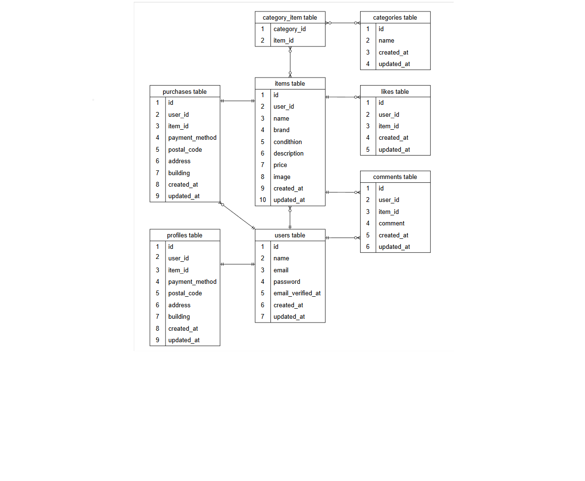

# coachtec-flea-market
## 概要　　
ある企業が開発した独自のフリマアプリです。  
ユーザーは商品を出品したり、他ユーザーの商品を購入したりすることができます。  

  
## 目的  
商品の出品から購入までを、ECサイト上で完結できるフリマアプリを構築すること。  


## 機能一覧  
* 会員登録
* ログイン/ログアウト
* 商品出品
* 商品一覧表示
* 商品詳細表示
* コメント
* いいね
* 商品購入
* Stripeによる決済機能
* ハイ移送先変更機能
* マイページ
* プロフィール編集

## 使用技術 
* PHP 8.1.34
* Laravel 8.83.29
* MySQL
* Docker
* Blade
* Laravel Fortify(認証機能)
* Stripe(決済)

## 環境構築 

### Dockerビルド
```
git clone https://github.com/ma-in-ko/coachtec-flea-market.git
cd coachtec-flea-marcket
docker compose up -d --build
```

### Laravelセットアップ
```
docker compose exec php bash  
composer install  
cp .env.example .env  
php artisan key:generate
php artisan storage:link
```

### データベース
```
php artisan migrate  
```

## 認証機能

本アプリではユーザー認証機能委としてLaravle Fortifyを使用しています。

### 実装内容
　* 会員登録
  * ログイン
  * ログアウト

### バリデーション
会員登録時のバリデーションはFormRequestを使用して実装しています。

### 初回ログイン
会員登録後はプロフィール設定画面へ遷移し、ユーザー情報を登録できるようにしています。

## Stripe設定

.envファイルに以下を設定してください。

STRIPE_KEY=公開鍵
STRIPE_SECRET=シークレットキー

Stripeのテストモードを使用しています。

テストカード番号
4242　4242　4242　4242

有効期限：任意の未来日
ＣＶＣ：任意の3桁

## URL  
*環境開発  
 http://localhost  
*phpMyAddmin  
 http://localhost:8080  

## ER図  


## 作成者

